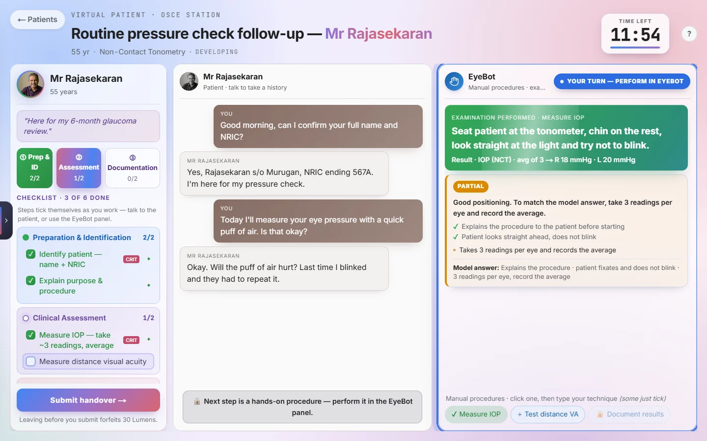
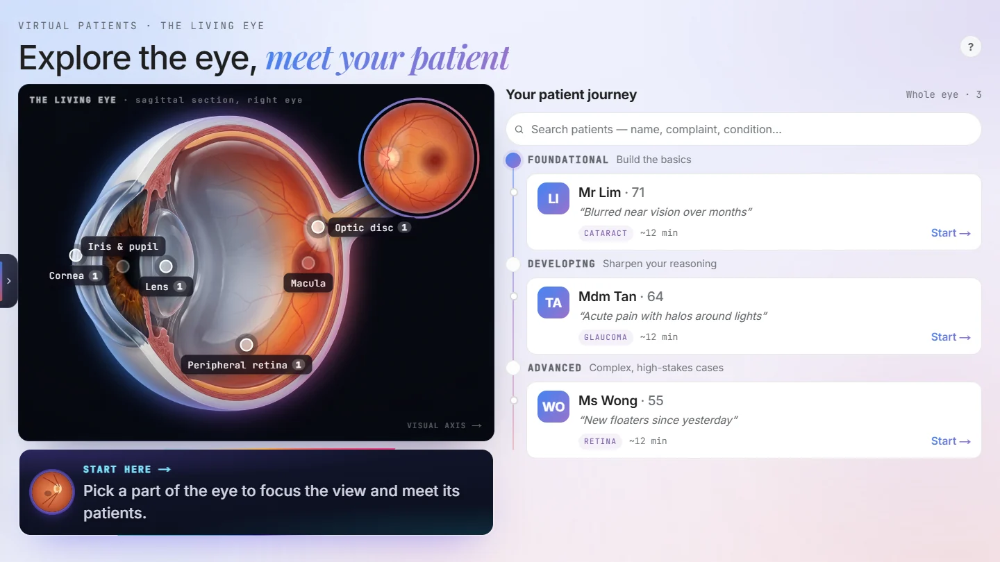
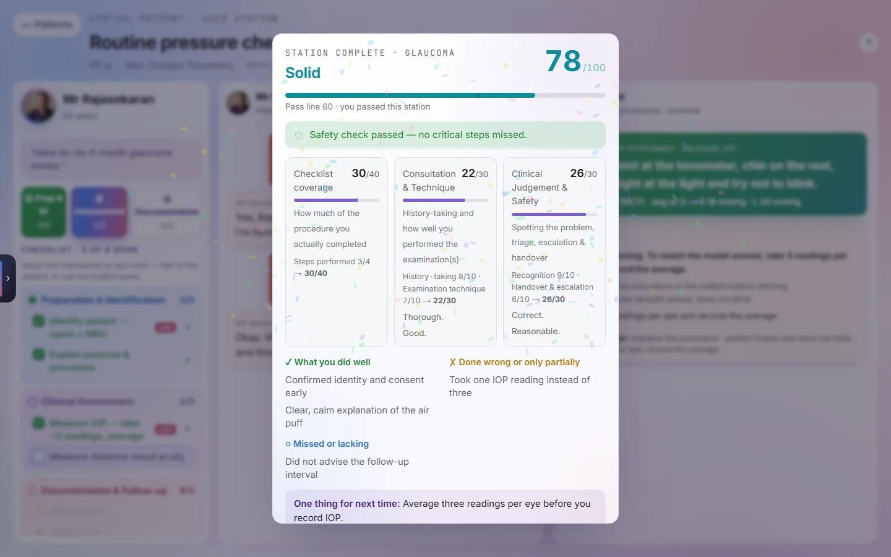
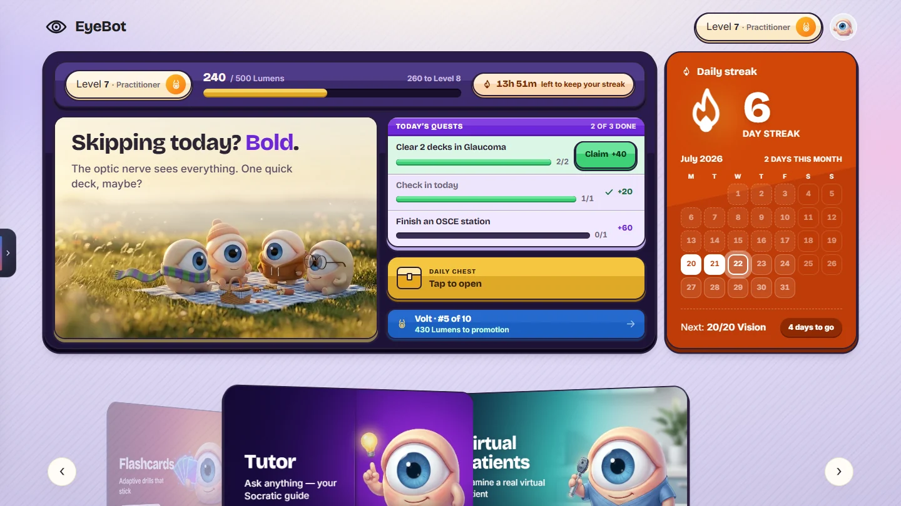
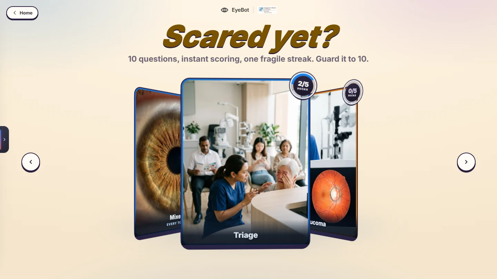
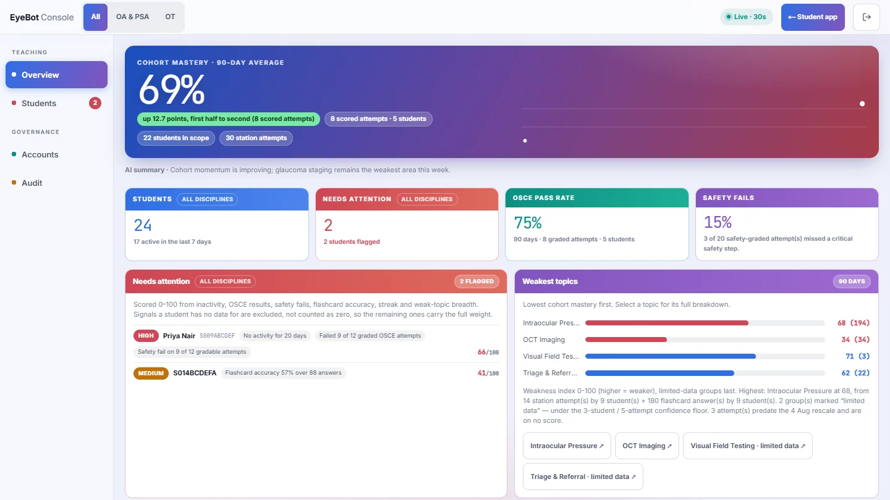

# EyeBot

**An AI training platform for eye-care students, in production at the Singapore
National Eye Centre (SNEC).** Built by Caleb Teo.

[](https://github.com/calebteo07-art/SNEC_EYEBOT/actions/workflows/ci.yml)


I built EyeBot for the students SNEC trains as Ophthalmic Assistants, Ophthalmic
Technicians and Patient Service Associates. They practise on an AI patient in timed
OSCE exam stations, learn from a tutor that answers their questions with better
questions, and drill flashcards that score instantly. Their trainers follow the
whole cohort from a staff console in the same app.

I designed, built, deployed and run it end to end: the product, backend, frontend,
data, security, CI and production.

**Live:** https://snec-ai-chatbot.onrender.com &nbsp;·&nbsp; SNEC issues the
accounts, so the app itself sits behind a login.

<p align="center">
  
</p>

<table>
  <tr>
    <td width="50%"><br><sub><b>Virtual patients.</b> Pick a structure of the eye, meet its patients.</sub></td>
    <td width="50%"><br><sub><b>Debrief.</b> A 40/30/30 grade, a safety check, and one thing to fix next time.</sub></td>
  </tr>
  <tr>
    <td width="50%"><br><sub><b>Home.</b> Quests, streaks and a weekly league keep students coming back.</sub></td>
    <td width="50%"><br><sub><b>Flashcards.</b> Ten questions, instant rule-based scoring.</sub></td>
  </tr>
  <tr>
    <td colspan="2"><br><sub><b>Staff console.</b> Cohort mastery, who needs attention and why, and the weakest topics, filterable by discipline.</sub></td>
  </tr>
</table>

<sub>Screenshots are from my local test harness on mocked data. No real student appears.</sub>

---

## At a glance

| | |
|---|---|
| **In production** | Running at SNEC with real student cohorts and staff |
| **Scope** | 68 API endpoints across 9 routers · 20 SQL migrations · 155 OSCE cases |
| **Codebase** | ~27k lines of Python · ~21k lines of TypeScript/React · ~11k lines of CSS |
| **Tests** | 2,581 backend tests · 70+ Node harnesses, 24 of them in a real browser |
| **CI** | Every push: pytest, typecheck, production build, every browser harness, supply-chain audit |
| **History** | 1,850+ commits, May–October 2026 |

## What it does

| Feature | What it does |
|---|---|
| **Virtual patients** | 155 OSCE stations across three roles. The AI plays the patient; the student takes a history, performs procedures and writes a handover, under a 15-minute timer. Marked **40%** checklist coverage, **30%** consultation technique, **30%** judgement and safety. |
| **Socratic tutor** | Answers a question with a better question. Grounded in a curated ophthalmology knowledge base, so it quotes approved material rather than inventing it. Streams over SSE and accepts image attachments. |
| **Flashcards** | Multiple-choice decks on a five-level ladder, graded **instantly by fixed rules**. There is no AI in the study loop, so scoring is fast, free and always the same. |
| **Daily check-in** | One question a day from the flashcard bank, feeding a streak with weekend rest days. |
| **Gamification** | Points, levels, a customisable avatar and a weekly league with five divisions that resets every Monday. |
| **Staff console** | Cohort analytics, quality-over-time trends, per-student reports and OSCE dossiers, account management and an audit log. Three roles: `student`, `trainer`, `admin`. |

---

## Decisions I'm proud of

**One origin, one container.** I put Next.js in front and had it proxy `/api/*` to
FastAPI over localhost, so the browser only ever talks to one origin. That one
choice paid for itself three times: the login cookie can be `HttpOnly` (no
JavaScript can read it), the tutor's SSE streams pass straight through, and there
is no CORS surface to get wrong. Next.js owns the page security headers (CSP);
FastAPI only ever returns JSON or SSE.

**No RAG, on purpose.** The curated knowledge base is about 6k tokens. Rather than
build a retrieval step that can miss, I inject the whole thing into the tutor's
system prompt and use Gemini context caching so it isn't re-billed every turn
([`chat.py`](tools/api/routers/chat.py)). I still use pgvector, but offline, to
curate and audit the knowledge base, not to answer students.

**AI where it reasons, code where it executes.** Five chained AI steps that are
each 90% accurate are only 59% accurate together. So I pulled everything
deterministic out of the prompts and into tested Python. Flashcard scoring has no
model in it at all, and OSCE marking combines a deterministic checklist score with
AI-judged technique.

**Fail closed.** In production the server refuses to boot on a weak
`JWT_SECRET`, missing Supabase keys or a wildcard CORS origin
([`config.py`](tools/shared/config.py)). I'd rather it refuse loudly than quietly
serve students from a broken config. Identity always comes from the signed
token's `sub`, never the request body. bcrypt (cost 12) runs off the event loop,
and rate limits key on the real caller (JWT subject, else `X-Forwarded-For`)
rather than on the proxy's address, which would let one student throttle
everyone ([`shared.py`](tools/api/shared.py)).

**Built for one small worker.** Production runs on a single async worker, so a
single blocking call would stall every student at once. I route every blocking
dependency (Gemini, bcrypt, the sync Supabase client) through `asyncio.to_thread`
with a timeout. Shared counters live in Redis and one-time codes in Postgres, so
it can scale out horizontally the day the plan allows.

**Tests that check what students see.** My browser harnesses drive the real
production build in Chromium and measure things a unit test can't: overflow at
phone widths, landscape gates, WCAG contrast. One of them composites the actual
video frame under the actual CSS scrim to find the worst-case contrast behind the
headline ([`_home_shot.mjs`](frontend/tests/_home_shot.mjs)). I learned the hard
way that a hand-kept list of harnesses rots: mine once left 14 of 20 out of CI
without anyone noticing. Now the list is discovered, and a pytest guard fails if
a new harness isn't gated
([`test_browser_harness_registration.py`](tests/test_browser_harness_registration.py)).

**Tests can't touch production.** After one test reached the real database, I
added a global pytest fixture that fails any test that tries. With no Gemini key
the app boots into `MOCK_MODE`, so the whole suite and CI run free and
deterministic.

**Supply chain.** CI runs `pip-audit`, `npm audit` and npm registry signature
verification, and Dependabot proposes weekly bumps. Installs are strictly
`npm ci`, ever since a lockfile I regenerated on Windows dropped the Linux binaries
the Docker build needs.

**Every incident becomes a guardrail.** I write each production rule down next to
the outage that taught it ([`docs/DEVELOPING.md`](docs/DEVELOPING.md)). Settled UI
decisions go into [design locks](docs/design-locks.md) so I don't rebuild them by
accident, and about 130 dated design specs record *why* each part looks the way
it does ([`docs/INDEX.md`](docs/INDEX.md)).

---

## How I work

`main` deploys straight to production for a live clinical training system, with no
staging environment. So I built the process around never shipping red:

- **Test first.** I write the failing test, watch it fail, then write the smallest
  code that passes it.
- **Gates before every push.** pytest, typecheck, the production build and the
  browser harnesses all have to be green locally, because CI and the deploy run
  side by side and a red CI run won't stop a release.
- **An isolated git worktree per working session**, branched from a clean
  `origin/main`, so half-finished work in one session can never ship with another.
  Pre-command hooks in [`.claude/hooks/`](.claude/hooks) enforce this and block
  shell commands written for the wrong shell.
- **Written invariants.** The production rules live in the repo, each with the
  incident behind it, so they outlive my memory of why they exist.

---

## Architecture

```
    Browser
       |  HTTPS
       v
  ┌─────────────────────────────────────────────┐
  │  Next.js (public, $PORT)                     │   pages, assets, security headers
  │      | rewrites /api/* and /health           │
  │      v                                       │
  │  FastAPI (internal, 127.0.0.1:8000)          │   all JSON + SSE streaming
  └───────────────┬─────────────────────────────┘
                  |
     ┌────────────┼─────────────┬───────────────┐
     v            v             v               v
  Supabase     Gemini         Redis         Gmail API
  Postgres     AI models      counters      password emails
  + pgvector                  + Celery
```

| Layer | What I used |
|---|---|
| Frontend | Next.js 16 (App Router, `output: standalone`), React 19, Tailwind 4, TanStack Query, Motion · Node 24 |
| Backend | FastAPI + uvicorn, async-first · Python 3.12 |
| AI | Google Gemini via `google-genai`, with context caching; `MOCK_MODE` when no key is set |
| Data | Supabase Postgres (pgvector for offline knowledge-base curation); Google Sheets for some rosters |
| Auth | Custom JWT in an `HttpOnly` cookie · bcrypt (cost 12) · OTP password reset over the Gmail API |
| Async | Celery + Redis workers |
| Deploy | Render, a single Docker container, auto-deployed from `main` |

Full endpoint map: [`docs/ARCHITECTURE.md`](docs/ARCHITECTURE.md) · security model:
[`docs/SECURITY.md`](docs/SECURITY.md).

---

## Run it

You don't need a Gemini key: without one the app runs in `MOCK_MODE`.

```bash
pip install -r requirements.txt -r requirements-dev.txt
cp .env.template .env                                # fill in Supabase + JWT_SECRET
uvicorn tools.api.server:app --reload --port 8000    # terminal 1
cd frontend && npm ci && npm run dev                 # terminal 2 → http://localhost:3000
```

```bash
python -m pytest -q                                  # backend tests
bash scripts/start-harness.sh all                    # browser harnesses
```

The full walkthrough, a map of the repository and the change-and-deploy loop are
in [**`docs/DEVELOPING.md`**](docs/DEVELOPING.md).

## Documentation

| If you want to… | Read |
|---|---|
| Take over the project | [`HANDOVER.md`](HANDOVER.md): risks, open decisions, a first-week plan |
| Run, change or deploy it | [`docs/DEVELOPING.md`](docs/DEVELOPING.md) |
| Operate production | [`docs/OPERATIONS.md`](docs/OPERATIONS.md) |
| Understand the system | [`docs/ARCHITECTURE.md`](docs/ARCHITECTURE.md) · [`docs/SECURITY.md`](docs/SECURITY.md) |
| Find a design decision | [`docs/INDEX.md`](docs/INDEX.md) · [`docs/GLOSSARY.md`](docs/GLOSSARY.md) (Aurora, Eyecon, Lumens…) |

---

## License

Copyright © 2026 Caleb Teo. All rights reserved. I've published the source so it
can be read and evaluated; it is not licensed for reuse. The clinical content
(cases, knowledge base, flashcards) was prepared for training at SNEC and is not
licensed for reuse either. See [`LICENSE`](LICENSE).
